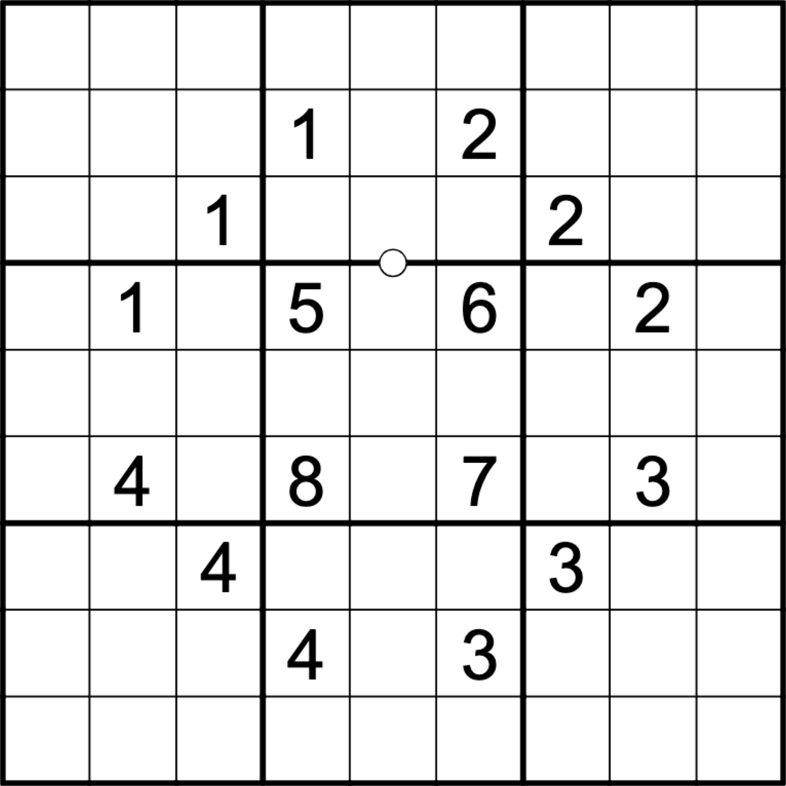
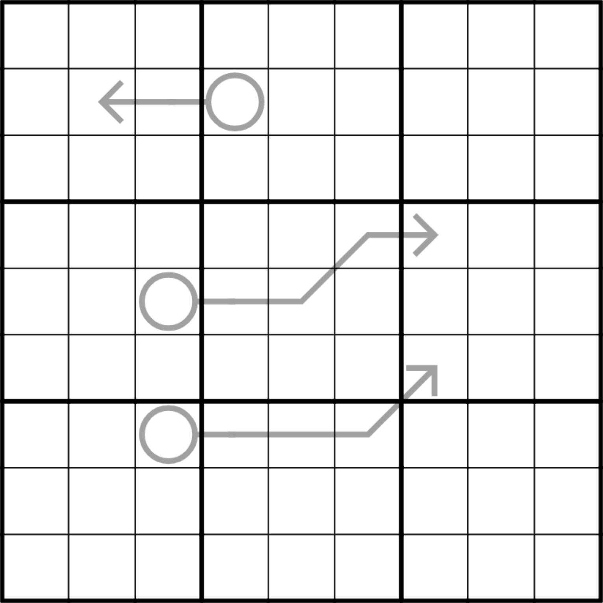

# Butterfly

2021-12-23, my first foray into setting

**Rules:**
[standard](#standard)
[arrow](#arrow)
[killer](#killer)
[little killer](#little-killer)
[rising diagonal](#diagonal)

**Play online:**
[CtC](https://tinyurl.com/b7twmz48)
[f-puzzles](https://f-puzzles.com/?id=yxnpswht)

Hint 1
 
The upper-right arrows are very restricted: what digits can appear in r3c5 and r5c7?

Hint 2
 
Consider applying set theory to the red and blue regions here: https://tinyurl.com/bp7u2pv5.

# How to Peel a Cavendish Banana

2022-01-02, created for the CtC discord's monthly puzzle prompt "food"

**Rules:**
[standard](#standard)
[arrow](#arrow)
[clones](#clones)

**Play online:**
[CtC](https://tinyurl.com/5a7kve6r)
[f-puzzles](https://f-puzzles.com/?id=y28knjuw)

# Overconstrained 1

2022-01-28

**Rules:**
[standard](#standard)
[disjoint](#disjoint)
[anti-knight](#anti-knight)

**Play online:**
[CtC](https://tinyurl.com/2p9a9kxh)
[f-puzzles](https://f-puzzles.com/?id=ycenxedq)

# Overconstrained 2

2022-01-28

**Rules:**
[standard](#standard)
[disjoint](#disjoint)
[anti-knight](#anti-knight)
[kropki](#kropki)

No negative Kropki constraint: not all dots are necessarily given.

**Play online:**
[CtC](https://tinyurl.com/2p8pf4t3)
[f-puzzles](https://f-puzzles.com/?id=y9jvczpk)

# Killer hypercube

2022-01-28

**Rules:**
[hypercube](#hypercube)
[killer](#killer)

**Play online:**
[CtC](https://tinyurl.com/mvxkfnh6)
[f-puzzles](https://f-puzzles.com/?id=yddv7dur)

# Arrow hypercube

2022-02-02

**Rules:**
[hypercube](#hypercube)
[arrow](#arrow)

**Play online:**
[CtC](https://tinyurl.com/4xv3jc6d)
[f-puzzles](https://f-puzzles.com/?id=y74otltk)

# Thermo hypercube

2022-02-03, designed for minimality, not as an interesting puzzle

**Rules:**
[hypercube](#hypercube)
[thermo](#thermo)

**Play online:**
[CtC](https://tinyurl.com/yc488r77)
[f-puzzles](https://f-puzzles.com/?id=y8wrjhla)

# Farmhouse killer

2022-08-17, at Launceston Farm

**Rules:**
[killer](#killer)
[arrow](#arrow)

**Play online:**
[CtC](https://tinyurl.com/5xx8n89k)

# Suchoku

2024-02-24, a mashup of Sudoku and a pencil puzzle

**Rules:**
[standard](#standard)
[little killer](#little-killer)

Choco banana: Shade some cells to form some shaded and unshaded orthogonally connected regions. Shaded regions must be rectangular. Unshaded regions must not be rectangular. Circled digits give the size of the enclosing region. Uncircled digits do not.

**Play online:**
[CtC](https://app.crackingthecryptic.com/ujsjiugpc7)

# Paradox lost

**Rules:**
[standard](#standard)
[fog of war](#fog-of-war)

The puzzle has a unique solution.

**Play online:**
[CtC](https://sudokupad.app/8f5imhpieq)

# Rules

## Standard

Place the digits 1-9 in every row, column, and box.

## Disjoint

Place the digits 1-9 in every box position.

For example, every digit appears in the upper-left corner of some box.

## Hypercube

The grid represents a 3x3x3x3 hypercube.
Place the digits 1-9 in each 3x3 orthogonal square within the hypercube.
These are: [boxes, rows, columns](#standard),
[groups of cells in the same position in each box (eg, r147c147)](#disjoint),
the left/middle/right vertical slices of a row of boxes (eg, r123c147), and
top/middle/bottom horizontal slices of a column of boxes (eg, r147c123).

## Arrow

Digits along an arrow sum to the digit in the bulb.

**Note:** Digits on an arrow can repeat if allowed by other rules.

## Killer

Digits within a cage may not repeat, and sum to the number in the upper-left corner if given.

## Little killer

The digits along a diagonal marked with a number sum to that number.

**Note:** Digits on such a diagonal can repeat if allowed by other rules.

## Thermo

Digits increase along a thermometer away from the bulb.

## Diagonal

The marked long diagonal(s) do not contain repeated digits.

## Clones

The marked areas are clones of each other, and contain the same digits in the same positions.

## Kropki

Digits separated by a white dot have a difference of 1.
Digits separated by a black dot have a ratio of 2.
Unless otherwise specified, all such dots are given.

## Fog of war

The grid is initially partially covered in fog. Entering digits clears the fog surrounding the entered digit.
